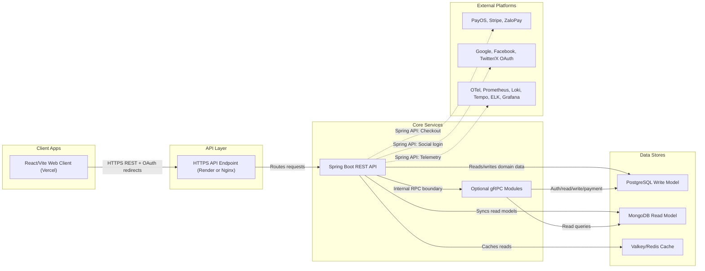

# VTI Clothing Shop Server

## Project name

**VTI Clothing Shop Server** là backend cho hệ thống bán quần áo, xây dựng bằng Spring Boot. Project cung cấp API quản
lý sản phẩm, danh mục, thương hiệu, người dùng, đơn hàng, voucher, nhập hàng, sale, chat/comment, thanh toán và thống
kê.

## Ai làm

- **Project owner**: VTI Clothing Shop Server team.
- **Cập nhật/refactor hiện tại**: được tổng hợp và triển khai với sự hỗ trợ của OpenAI Codex.
- Repo hiện chưa có file metadata riêng cho danh sách thành viên, vì vậy README không tự gán tên cá nhân cụ thể.

## Công nghệ chính

- Java 25, Spring Boot 4.1.0
- Spring Web, Spring Security, Spring Data JPA, Spring Data MongoDB
- PostgreSQL cho write model
- MongoDB cho read model
- Valkey cho cache
- MapStruct, Lombok
- PayOS, Stripe, ZaloPay
- gRPC Java, Protocol Buffers
- OpenTelemetry, Prometheus, Grafana, Loki, Tempo, Elasticsearch, Logstash, Kibana
- Docker Compose, Kubernetes/Kustomize
- JUnit 5, Mockito, JaCoCo, SonarCloud, Jenkins

## Kiến trúc tổng quan



## Tính năng nổi bật

- CRUD cho các domain chính: brand, category, product, user, order, order item, voucher, chat, comment, input sale,
  imported product.
- Thanh toán qua PayOS, Stripe và ZaloPay.
- Tách module gRPC cho `auth`, `read`, `write`, `payment`.
- Đọc dữ liệu tối ưu qua MongoDB read model, ghi dữ liệu chính qua PostgreSQL.
- Đồng bộ PostgreSQL sang MongoDB bằng service sync/read bootstrap.
- Cache bằng Valkey cho các hàm đọc phù hợp.
- Social login qua Google, Facebook va Twitter/X, sau khi login thanh cong tra ve JWT qua redirect fragment.
- Global exception handler cho lỗi chung và unchecked exception.
- AOP logging cho unchecked exception để log nhanh và thống nhất hơn.
- Đa ngôn ngữ label message: `en`, `es`, `de`, `fr`, `ca`, `it`.
- Observability đầy đủ: metrics, logs, traces, dashboard và log search.
- Docker init dummy data cho PostgreSQL.
- Jenkins pipeline cho build, test, SonarCloud, Docker image va optional/manual Kubernetes deploy.
- Unit test cho service layer và CI tích hợp SonarCloud.

## Cấu trúc thư mục

```text
VTI_Clothing_Shop_Server/
|-- .github/
|   `-- workflows/
|       `-- ci-cd.yml
|-- clothing_shop/
|   |-- Dockerfile
|   |-- pom.xml
|   |-- mvnw / mvnw.cmd
|   `-- src/
|       |-- main/
|       |   |-- java/vn/vti/clothing_shop/
|       |   |   |-- configs/
|       |   |   |-- constants/
|       |   |   |-- controllers/
|       |   |   |-- dtos/
|       |   |   |-- entities/
|       |   |   |-- exceptions/
|       |   |   |-- mappers/
|       |   |   |-- middlewares/
|       |   |   |-- modules/
|       |   |   |-- readmodels/
|       |   |   |-- repositories/
|       |   |   |-- responses/
|       |   |   |-- services/
|       |   |   `-- validators/
|       |   `-- resources/
|       |       |-- application.properties
|       |       `-- labels/
|       `-- test/
|           |-- java/
|           `-- resources/
|-- docker/
|   |-- nginx/
|   |   `-- nginx.conf
|   |-- observability/
|   |   |-- grafana/
|   |   |-- logstash/
|   |   |-- loki-config.yml
|   |   |-- otel-collector-config.yml
|   |   |-- prometheus.yml
|   |   `-- tempo-config.yml
|   `-- postgres/
|       `-- init/
|           `-- 01_dummy_data.sql
|-- k8s/
|   |-- monitoring/
|   |-- package/
|   `-- README.md
|-- docker-compose.yml
|-- Jenkinsfile
|-- LICENSE
`-- README.md
```

## Package chính trong source code

- `configs`: cấu hình security, cache, logging, payment, repository.
- `controllers`: REST controllers.
- `dtos`: request/response DTO.
- `entities`: JPA entities cho PostgreSQL.
- `readmodels`: MongoDB documents/repositories cho read model.
- `repositories`: JPA repositories.
- `services`: business logic, payment, sync PostgreSQL -> MongoDB.
- `responses`: response wrapper, message resolver, global exception handler.
- `middlewares`: login interceptor, OAuth2 handlers and rate-limit interceptor.
- `modules`: gRPC boundary cho auth, read, write và payment.
- `validators`: custom validation annotations.
- `labels`: message bundle đa ngôn ngữ.

## Chạy local bằng Maven

Yêu cầu:

- Java 25+
- PostgreSQL local hoặc chạy qua Docker
- MongoDB local hoặc chạy qua Docker
- Valkey local hoặc chạy qua Docker

```powershell
cd .\clothing_shop
# Set required env vars first: POSTGRESQL_PASSWORD and JWT_SECRET_KEY.
.\mvnw.cmd spring-boot:run
```

Ứng dụng chạy mặc định tại:

```text
http://localhost:8080
```

## Chạy full stack bằng Docker Compose

Từ root repo:

```powershell
Copy-Item .\.env.example .\.env
# Fill POSTGRESQL_PASSWORD, JWT_SECRET_KEY, GRAFANA_ADMIN_PASSWORD and any provider keys in .env
docker compose up --build
```

Các endpoint local:

- Application: `http://localhost:8080`
- API Gateway: `http://localhost:8088`
- API Gateway gRPC: `localhost:19090`
- Application gRPC modules: `localhost:9091`
- PostgreSQL: `localhost:5432`
- Valkey: `localhost:6379`
- MongoDB: `localhost:27017`
- Prometheus: `http://localhost:9090`
- Grafana: `http://localhost:3000`
- Loki: `http://localhost:3100`
- Tempo: `http://localhost:3200`
- Elasticsearch: `http://localhost:9200`
- Kibana: `http://localhost:5601`
- OpenTelemetry Collector HTTP: `localhost:4318`
- OpenTelemetry Collector gRPC: `localhost:4317`

## Swagger / OpenAPI

Swagger UI:

```text
http://localhost:8080/swagger-ui.html
http://localhost:8088/swagger-ui.html
```

OpenAPI JSON:

```text
http://localhost:8080/v3/api-docs
```

Swagger duoc cau hinh theo nhom API, co nut `Authorize` cho JWT bearer token, co header `Accept-Language` cho message da
ngon ngu, va co cac path OAuth2 social login. O production profile, Swagger mac dinh tat; bat lai bang:

```text
SPRINGDOC_ENABLED=true
```

## OAuth2 social login

Social login duoc bat bang Spring Security OAuth2 Client. Client frontend co the redirect user toi:

```text
/oauth2/authorization/google
/oauth2/authorization/facebook
/oauth2/authorization/twitter
```

Callback URI can khai bao tren tung provider:

```text
{baseUrl}/login/oauth2/code/google
{baseUrl}/login/oauth2/code/facebook
{baseUrl}/login/oauth2/code/twitter
```

Sau khi login thanh cong, backend redirect ve `OAUTH2_SUCCESS_REDIRECT_URL` voi fragment:

```text
#token=<jwt>&name=<display-name>&avatarUrl=<avatar-url>
```

Neu that bai, backend redirect ve `OAUTH2_FAILURE_REDIRECT_URL?error=<code>`. Neu provider chua duoc cau hinh client
id/secret thi registration do se khong duoc expose.

## gRPC microservice modules

Contract gRPC nằm tại:

```text
clothing_shop/src/main/proto/clothing_shop_modules.proto
```

Các module service hiện có:

- `AuthModuleService`: login và validate token.
- `PaymentModuleService`: tạo checkout qua PayOS, Stripe, ZaloPay hoặc manual payment.
- `ReadModuleService`: query read model từ MongoDB theo model/id/owner/lookup key.
- `WriteModuleService`: nhận command ghi cho order và command sync/remove read model.

Mặc định app mở gRPC server tại port `9091`. Có thể tách runtime theo module bằng env flag:

```powershell
set GRPC_SERVER_PORT=9091
set AUTH_MODULE_ENABLED=true
set PAYMENT_MODULE_ENABLED=false
set READ_MODULE_ENABLED=false
set WRITE_MODULE_ENABLED=false
```

Client target mặc định trỏ về cùng app, nhưng có thể đổi sang service riêng:

```text
AUTH_GRPC_TARGET=auth-service:9091
PAYMENT_GRPC_TARGET=payment-service:9091
READ_GRPC_TARGET=read-service:9091
WRITE_GRPC_TARGET=write-service:9091
```

Grafana credentials are read from environment variables:

```text
GRAFANA_ADMIN_USER
GRAFANA_ADMIN_PASSWORD
```

## Kubernetes

Kubernetes được chia thành 2 module Kustomize:

- `k8s/monitoring`: observability stack.
- `k8s/package`: application, PostgreSQL, MongoDB, Valkey và init dummy data.

Build image local:

```powershell
docker build -t vti-clothing-shop-server:latest .\clothing_shop
```

Apply module:

```powershell
Copy-Item .\k8s\monitoring\grafana-secret.env.example .\k8s\monitoring\grafana-secret.env
Copy-Item .\k8s\package\app-secret.env.example .\k8s\package\app-secret.env
# Fill both *.env files with real values before applying.
kubectl apply -k .\k8s\monitoring
kubectl apply -k .\k8s\package
```

Port-forward khi phát triển local:

```powershell
kubectl -n vti-clothing-shop port-forward svc/clothing-shop-server 8080:8080
kubectl -n vti-clothing-shop port-forward svc/clothing-shop-server 9091:9091
kubectl -n vti-clothing-shop port-forward svc/api-gateway 8088:80
kubectl -n vti-clothing-shop port-forward svc/api-gateway 19090:9090
kubectl -n vti-clothing-shop-monitoring port-forward svc/grafana 3000:3000
kubectl -n vti-clothing-shop-monitoring port-forward svc/prometheus 9090:9090
kubectl -n vti-clothing-shop-monitoring port-forward svc/kibana 5601:5601
```

## Biến môi trường quan trọng

| Biến                           | Mục đích                                          |
|--------------------------------|---------------------------------------------------|
| `POSTGRESQL_URL`               | JDBC URL tới PostgreSQL                           |
| `POSTGRESQL_USERNAME`          | Username PostgreSQL                               |
| `POSTGRESQL_PASSWORD`          | Password PostgreSQL                               |
| `JWT_SECRET_KEY`               | Base64 encoded signing secret for JWT             |
| `JWT_EXPIRATION_TIME`          | JWT expiration in milliseconds                    |
| `APPLICATION_TIME_ZONE`        | Application timezone for stored OffsetDateTime    |
| `VALKEY_HOST`                  | Host Valkey                                       |
| `VALKEY_PORT`                  | Port Valkey                                       |
| `MONGODB_URI`                  | URI MongoDB read model                            |
| `READ_MODEL_BOOTSTRAP_ENABLED` | Bật/tắt bootstrap read model                      |
| `GRPC_SERVER_ENABLED`          | Bật/tắt gRPC server                               |
| `GRPC_SERVER_PORT`             | Port gRPC server                                  |
| `AUTH_GRPC_TARGET`             | Target gRPC của auth module                       |
| `PAYMENT_GRPC_TARGET`          | Target gRPC của payment module                    |
| `READ_GRPC_TARGET`             | Target gRPC của read module                       |
| `WRITE_GRPC_TARGET`            | Target gRPC của write module                      |
| `AUTH_MODULE_ENABLED`          | Bật/tắt auth module trên runtime hiện tại         |
| `PAYMENT_MODULE_ENABLED`       | Bật/tắt payment module trên runtime hiện tại      |
| `READ_MODULE_ENABLED`          | Bật/tắt read module trên runtime hiện tại         |
| `WRITE_MODULE_ENABLED`         | Bật/tắt write module trên runtime hiện tại        |
| `OAUTH2_SUCCESS_REDIRECT_URL`  | Frontend URL nhan JWT sau social login thanh cong |
| `OAUTH2_FAILURE_REDIRECT_URL`  | Frontend URL nhan loi social login                |
| `GOOGLE_OAUTH_CLIENT_ID`       | Google OAuth2 client id                           |
| `GOOGLE_OAUTH_CLIENT_SECRET`   | Google OAuth2 client secret                       |
| `FACEBOOK_OAUTH_CLIENT_ID`     | Facebook Login app/client id                      |
| `FACEBOOK_OAUTH_CLIENT_SECRET` | Facebook Login app/client secret                  |
| `TWITTER_OAUTH_CLIENT_ID`      | Twitter/X OAuth2 client id                        |
| `TWITTER_OAUTH_CLIENT_SECRET`  | Twitter/X OAuth2 client secret                    |
| `SPRINGDOC_ENABLED`            | Bat/tat Swagger/OpenAPI trong production profile  |
| `PAYOS_CLIENT_ID`              | PayOS client id                                   |
| `PAYOS_API_KEY`                | PayOS API key                                     |
| `PAYOS_CHECKSUM_KEY`           | PayOS checksum key                                |
| `STRIPE_SECRET_KEY`            | Stripe secret key                                 |
| `ZALOPAY_APP_ID`               | ZaloPay app id                                    |
| `ZALOPAY_KEY1`                 | ZaloPay key1                                      |
| `GRAFANA_ADMIN_USER`           | Grafana admin username                            |
| `GRAFANA_ADMIN_PASSWORD`       | Grafana admin password                            |
| `OTEL_EXPORTER_OTLP_ENDPOINT`  | Endpoint OpenTelemetry Collector                  |

## Test

Chạy unit test:

```powershell
cd .\clothing_shop
.\mvnw.cmd test
```

Chạy verify kèm JaCoCo:

```powershell
cd .\clothing_shop
.\mvnw.cmd verify
```

## SonarCloud

CI workflow nằm tại:

```text
.github/workflows/ci-cd.yml
```

Cần cấu hình các secret/variable sau trên GitHub:

- `SONAR_TOKEN`
- `SONAR_ORGANIZATION`
- `SONAR_PROJECT_KEY`
- `SONAR_HOST_URL` nếu không dùng mặc định `https://sonarcloud.io`

## Jenkins

Jenkins pipeline nam tai:

```text
Jenkinsfile
```

Pipeline an toan theo mac dinh:

- `Build and Test`: chay `.\mvnw.cmd clean verify` tren Windows agent hoac `./mvnw clean verify` tren Linux agent.
- `SonarCloud Analysis`: chi chay khi `RUN_SONAR=true` va da khai bao `SONAR_ORGANIZATION`, `SONAR_PROJECT_KEY`.
- `Build Docker Image`: build image tu `clothing_shop/Dockerfile` voi tag `${BUILD_NUMBER}-${GIT_SHA}` va `latest`.
- `Push Docker Image`: mac dinh tat, chi push khi `PUSH_DOCKER_IMAGE=true`.
- `Deploy Kubernetes (manual)`: mac dinh tat, can `DEPLOY_K8S=true` va phai bam confirm trong Jenkins `input` step.

Jenkins credentials nen tao:

| Credential id                  | Type              | Muc dich                                         |
|--------------------------------|-------------------|--------------------------------------------------|
| `sonar-token`                  | Secret text       | Token cho SonarCloud                             |
| `docker-registry-credentials`  | Username/password | Docker registry login khi push image             |
| `kubeconfig`                   | Secret file       | Kubeconfig cho optional Kubernetes deploy        |
| `clothing-shop-app-secret-env` | Secret file       | Contents for `k8s/package/app-secret.env`        |
| `grafana-secret-env`           | Secret file       | Contents for `k8s/monitoring/grafana-secret.env` |

Tham so quan trong:

| Parameter           | Mac dinh                   | Muc dich                                         |
|---------------------|----------------------------|--------------------------------------------------|
| `RUN_SONAR`         | `true`                     | Bat/tat SonarCloud stage                         |
| `DOCKER_REGISTRY`   | rong                       | Registry host; de rong thi chi build local image |
| `DOCKER_IMAGE_NAME` | `vti-clothing-shop-server` | Ten image                                        |
| `PUSH_DOCKER_IMAGE` | `false`                    | Push image len registry                          |
| `DEPLOY_K8S`        | `false`                    | Bat optional Kubernetes deploy                   |
| `DEPLOY_ENV`        | `int`                      | Spring profile ap dung cho Kubernetes deployment |
| `APPLY_MONITORING`  | `false`                    | Apply them `k8s/monitoring` truoc package        |

Jenkins agent can co Java 25 va Docker CLI/daemon neu build Docker image. Kubectl chi can khi chay deploy manual. Neu
deploy vao cluster khong dung local image cache, hay bat `PUSH_DOCKER_IMAGE=true` va dung image tu registry.

## Ghi chú bảo mật

- Docker Compose reads secrets from local `.env`; Kubernetes Kustomize reads them from ignored `*.env` files under
  `k8s`.
- Do not commit real JWT secret, payment keys, OAuth client secrets, database credentials, or Grafana credentials.
- Enable security for Elasticsearch before using a shared or production environment.
